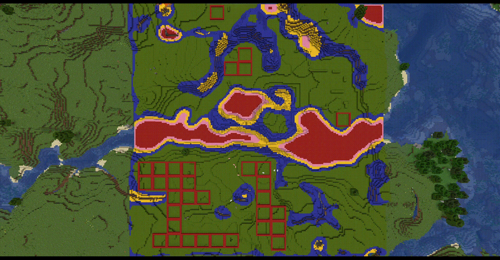
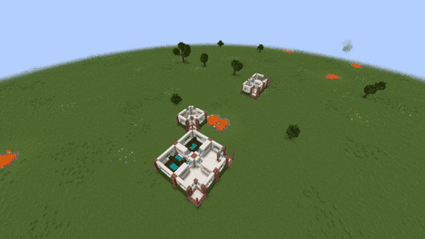
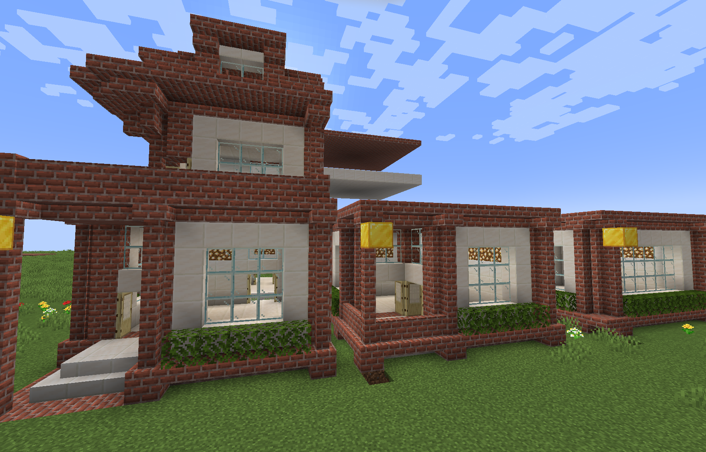
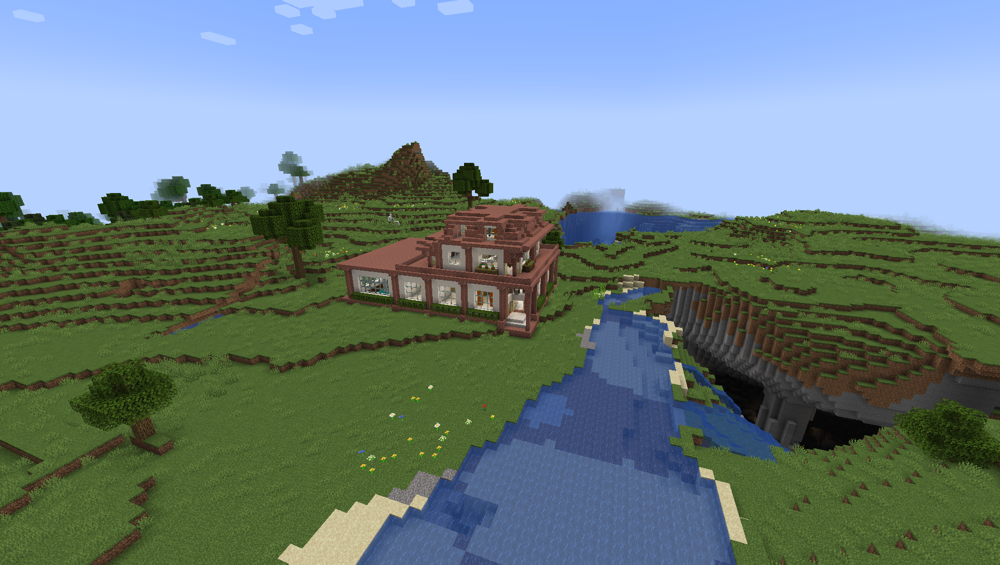
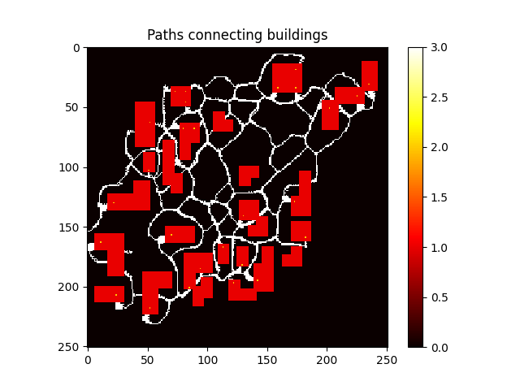

# MGAIA-Minecraft-GDMC
Procedural content generation in Minecraft for the GDMC competition. 

This project uses a combination of interesting techniques to generate a settlement in Minecraft. 
It uses the wave function collapse algorithm to generate randomized realistic buildings in Minecraft.
Additionally, it uses water simulation to connect the buildings through realistic looking paths
Finally, it uses a large language model (LLM) to add a story to the settlement. 

# Getting Started
## Installation

The project uses Python [Poetry](https://python-poetry.org/) (version 1.3.2) to manage dependencies. However, installing the dependencies from `pyproject.toml` manually using pip should also work.
Additionally, using [Forge](https://files.minecraftforge.net/net/minecraftforge/forge/index_1.19.2.html) the [GDMC HTTP](https://github.com/Niels-NTG/gdmc_http_interface) interface mod (v1.0.0) needs to be installed in Minecraft (1.19.2).

## Running

The whole end to end script `main.py` contains building location finding, building generation, path and story generation.
Before running the script you must select the build area using the following command: `/setbuildarea ~ ~ ~ ~200 ~ ~200`.
Afterwards, the script can be run using `poetry run python3 assignment/main.py`.
The script is composed of different steps which are described below. 
Some steps can also be run individually. We found that running the generator in the savanna biome works quite well.

# Documentation
This project has no real documentation (yet). However, there is a [project report](docs/project_report.pdf), which explains all the components quite well. 

# Building Location Finding

# Building generation
This part is mostly adapted from a previous project [MGAIA-Minecraft](https://github.com/ScholliYT/MGAIA-Minecraft).

Full Videos: [generate building in flat world](https://cloud.fachschaften.org/s/iHzxSNXsZpsr46Z), [generate building in real world](https://cloud.fachschaften.org/s/c5NKyaDjYeLwEer)

### Structure Scanning and Building

1. Set the build area in Minecraft using `/setbuildarea ~1 ~ ~ ~11 ~6 ~10` (or similar)
2. Update the name for the structure in `structure_scanner.py`
3. Run `structure_scanner.py`

The structures are saved in `./structures`. There are some premade ones in this repository.

You can now replicate a single structure using `structure_builder.py` or go to the next steps.

### Showcase generation

The `brickhouse_showcase.py` builds a showcase of all available building structures. This is very useful to define the rules in the rule set 
because you get a visual representation of the structure's rotations.
Before running, you should verify that the build location in the script is okay for you.

### Building Generation

The main building generation happens in `brickhouse.py`. 
You can also run this file directly to generate a building (a brickhouse in this case).

1. Update the coordinates where to place the house in `brickhouse.py`
2. Update the maximum size of the house including air padding in `brickhouse.py`
    - `random_building(size=(7,2,7))` for a house of
    5x2x5 structure building blocks because of  
    "structure" air padding around it
3. Optionally, specify some fixed structures in `reinit()` that guide the algorithm
    - For example `wfc.collapse_cell_to_state([8,0,8], StructureRotation(brickhouse_courtyard, 0))` will ensure that a courtyard is placed at position (8,0,8) with rotation 0
    - The algorithm will use this information and build a house around it
    - This is very useful as the algorithm tends to not use certain cool structures ☹️
4. Run `brickhouse.py`. This might take a while. You can see the progress in the terminal.

You can also try to generate on a larger area like `WaveFunctionCollapse((17,2,17), ...)`
which will likely generate multiple unconnected houses (which still follows the rules!). 
Way larger areas unfortunately don't work because of recursion depth limitations. 

# Paths Between Buildings
We experimented with different algorithms to generate naturally looking paths to connect the buildings. The code for the experiments can be found in `Pathing_stand_alone_code`.
Here you can find the code for creating paths using three different algorithms: Ant Colony Simulation, Genetic Algorithm and water simulation. (Water simulation worked by far the best)

# Story Generation (LLM)

## Installation
By installing the required Python dependencies through Poetry, you should already have everything that is necessary to run the following commands.
## Regenerating texts
Run the following command to regenerate all texts using the LLM: `poetry run python3 assignment/narrator/narrator.py`. This will generate 30 narrations for each of the following building types: bakery, church, school, villager house, farm.
Running the command for the first time will download the GTP-2 model.

# Info
This project was realized as the third assignment of the course Modern Game AI Algorithms at Leiden University.

### Similar projects
- Wave Function Collapse in Minecraft: [MGAIA-Minecraft](https://github.com/ScholliYT/MGAIA-Minecraft)
  
